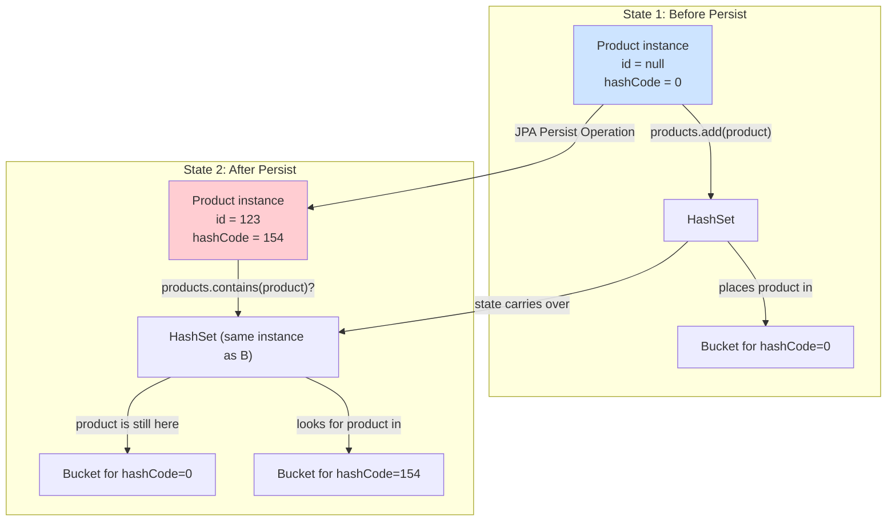

# The JPA equals() and hashCode() Dilemma with Generated IDs

When working with JPA entities that have database-generated IDs, implementing `equals()` and `hashCode()` is a common source of bugs. A correct implementation is crucial for collections like `HashSet` or `HashMap`, which rely on these methods to function correctly.

The core of the problem is that an object's `hashCode()` **must not change** while it is stored in a hash-based collection. If it does, the collection will no longer be able to find the object.

## The Problem: A Step-by-Step Demonstration

Let's use a simple `Product` entity where `equals()` and `hashCode()` are based on the database-generated `id`. This seems intuitive, but it's flawed.

```java
@Entity
public class Product {

    @Id
    @GeneratedValue(strategy = GenerationType.IDENTITY)
    private Long id;
    private String name;

    // Getters/Setters...

    @Override
    public boolean equals(Object o) {
        if (this == o) return true;
        if (o == null || getClass() != o.getClass()) return false;
        Product product = (Product) o;
        return Objects.equals(id, product.id);
    }

    @Override
    public int hashCode() {
        // Hash code is based on the ID
        return Objects.hash(id);
    }
}
```

### The Failing Scenario

Here is how this implementation breaks down:

1.  **Create a new Product.** At this point, its `id` is `null`. Its `hashCode()` is calculated based on `null` (which is `0`).
2.  **Add it to a `HashSet`.** The set stores the product in a "bucket" corresponding to `hashCode = 0`.
3.  **Persist the Product.** The database assigns an ID (e.g., `123L`), and the JPA provider updates the `id` field of our `product` instance.
4.  **The `hashCode()` changes.** The product's `hashCode()` is now different because the `id` is no longer `null`.
5.  **The Product is "lost".** If we call `products.contains(product)`, the set calculates the *new* hash code and looks in a *different bucket*. It doesn't find the product, so it returns `false`, even though the instance is still in the set.

### Visualizing the Problem

This diagram shows how the product gets lost in the `HashSet` after its ID is generated.



---

## Solution 1 (Best Practice): Use a Natural or Business Key

The most reliable solution is to base `equals()` and `hashCode()` on a **natural key** or a **business key**—a property that is unique, non-null, and immutable. For a `Product`, a `sku` (Stock Keeping Unit) is a perfect example. A SKU is a unique alphanumeric code used by retailers to identify and track a product for inventory purposes. Since every distinct product has a unique SKU that never changes, it makes an excellent and reliable business key.

### The Fixed Implementation

```java
@Entity
public class Product {

    @Id
    @GeneratedValue(strategy = GenerationType.IDENTITY)
    private Long id;

    @Column(unique = true, nullable = false, updatable = false)
    private String sku;

    // Constructors, getters, setters...

    @Override
    public boolean equals(Object o) {
        if (this == o) return true;
        if (o == null || getClass() != o.getClass()) return false;
        Product product = (Product) o;
        // Use the business key. It's guaranteed to be non-null and stable.
        return Objects.equals(sku, product.sku);
    }

    @Override
    public int hashCode() {
        // Use the business key. The hash code will be stable.
        return Objects.hash(sku);
    }
}
```

**Pros:**
-   Correctly follows the `hashCode` and `equals` contract.
-   Works for both transient and persistent entities.
-   Performs well in hash-based collections.

**Cons:**
-   Requires a suitable natural/business key on the entity.

---

## Solution 2: The Proxy-Aware, ID-Based Fallback

When no natural key is available, you can use a fallback strategy that is safe but has performance implications. This approach handles Hibernate's lazy-loading proxies and carefully defines equality to avoid issues with transient entities.

### The Implementation

```java
import org.hibernate.proxy.HibernateProxy;
import java.util.Objects;

@Entity
public class Product {

    @Id
    @GeneratedValue(strategy = GenerationType.IDENTITY)
    private Long id;
    private String name;

    // Getters/Setters...

    @Override
    public final boolean equals(Object o) {
        if (this == o) return true;
        if (o == null) return false;

        // Handle Hibernate proxies to get the true class
        Class<?> oEffectiveClass = o instanceof HibernateProxy
            ? ((HibernateProxy) o).getHibernateLazyInitializer().getPersistentClass()
            : o.getClass();
        Class<?> thisEffectiveClass = this instanceof HibernateProxy
            ? ((HibernateProxy) this).getHibernateLazyInitializer().getPersistentClass()
            : this.getClass();

        if (thisEffectiveClass != oEffectiveClass) return false;

        Product product = (Product) o;
        // Equality is only possible for persisted entities with non-null IDs.
        return getId() != null && Objects.equals(getId(), product.getId());
    }

    @Override
    public final int hashCode() {
        // This hash code is stable, as it's based on the class, not the ID.
        // It correctly handles proxies.
        return this instanceof HibernateProxy
            ? ((HibernateProxy) this).getHibernateLazyInitializer().getPersistentClass().hashCode()
            : getClass().hashCode();
    }
}
```

### How It Works

-   **`hashCode()`**: The hash code is based on the entity's *class*, not its ID. This means the hash code is the same for all `Product` instances and never changes, even when the ID is generated. It correctly unwraps Hibernate proxies to get the real class.
-   **`equals()`**: Equality is defined very strictly: two objects are equal only if they are of the same class and have the same non-null ID. A transient entity (with a `null` ID) can never be equal to another entity.

**Pros:**
-   Guarantees correctness and avoids the "lost object" problem in hash sets.
-   Safely handles Hibernate's lazy-loading mechanism.
-   Does not require a business key.

**Cons:**
-   **Performance Degradation**: Because all instances of the entity have the same hash code, they all go into the same "bucket" in a `HashSet` or `HashMap`. This degrades the collection's performance to O(n), effectively turning it into a list for lookups. This can be a significant issue for large collections.