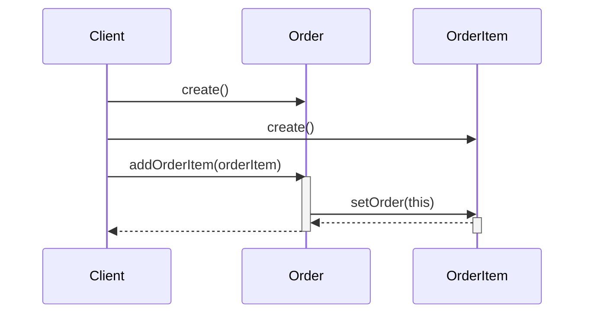
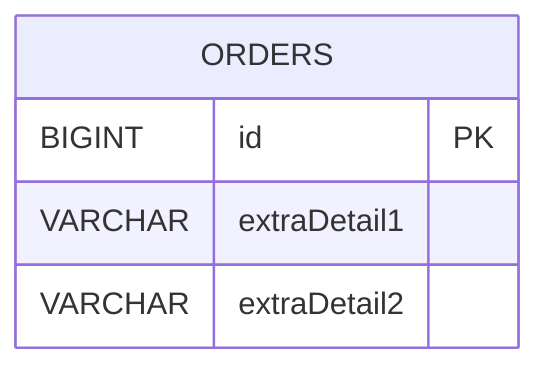
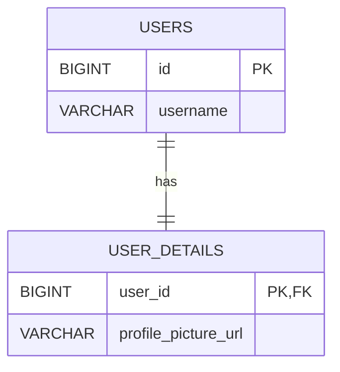
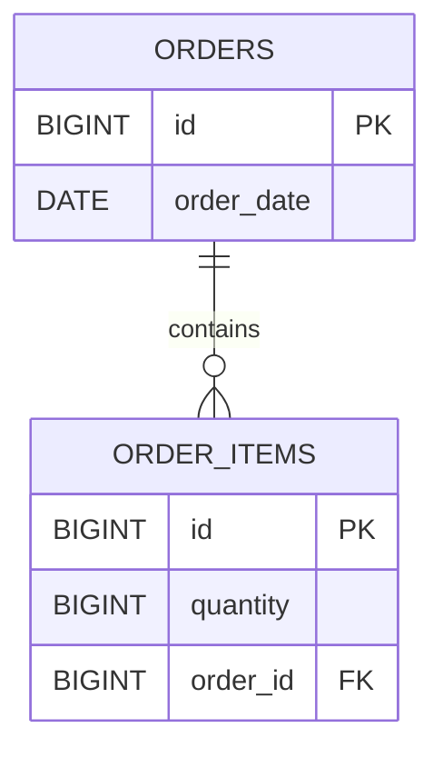
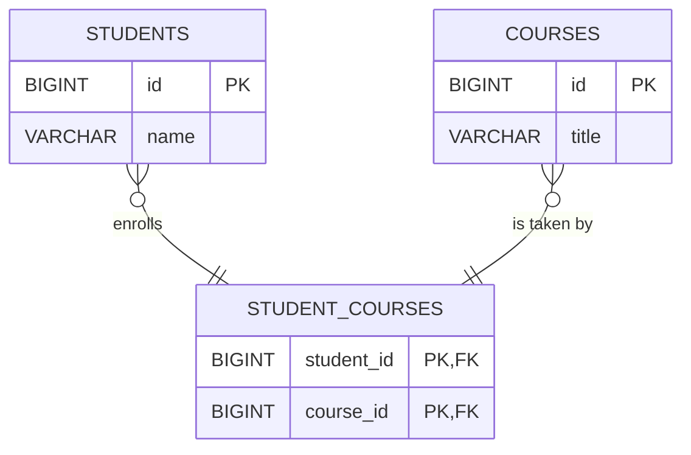

# A Guide to JPA & Hibernate Association Mappings: Best Practices

This guide provides a clear overview of entity association mappings in JPA, focusing on best practices to help you avoid common pitfalls.

## Core Concepts

### Relationship Directions

-   **Unidirectional:** The relationship is defined in only one of the associated entities.
-   **Bidirectional:** The relationship is defined in both associated entities, allowing for navigation from either side.

### Bidirectional Relationships & The Owning Side

In a bidirectional relationship, you must distinguish between the **owning side** and the **inverse side**.

-   **Owning Side:** This is the entity that "owns" the foreign key in the database. JPA only looks at this side to manage the relationship (i.e., to insert or update the foreign key column). **All modifications to the relationship must be made on the owning side.**
-   **Inverse Side:** This side "mirrors" the relationship but doesn't own it. It uses the `mappedBy` attribute to point back to the association field on the owning side, effectively delegating control.

For example, in a typical `Order` and `OrderItem` relationship, the `OrderItem` table has the `order_id` foreign key. Therefore, `OrderItem` is the **owning side**.

```java
// Inverse Side (Order)
@Entity
@Table(name = "ORDERS")
public class Order {
    @Id
    @GeneratedValue
    private Long id;

    // mappedBy="order" tells JPA that the 'order' field in the OrderItem entity
    // owns this relationship.
    @OneToMany(mappedBy = "order", cascade = CascadeType.ALL, orphanRemoval = true)
    private List<OrderItem> orderItems = new ArrayList<>();

    // Getters and setters
    public Long getId() { return id; }
    public List<OrderItem> getOrderItems() { return orderItems; }
    public void setOrderItems(List<OrderItem> orderItems) { this.orderItems = orderItems; }
}

// Owning Side (OrderItem)
@Entity
@Table(name = "ORDER_ITEMS")
public class OrderItem {
    @Id
    @GeneratedValue
    private Long id;

    private Long quantity;

    @ManyToOne(fetch = FetchType.LAZY)
    @JoinColumn(name = "order_id") // This FK column makes OrderItem the owner
    private Order order;

    // Getters and setters
    public Long getId() { return id; }
    public Long getQuantity() { return quantity; }
    public void setQuantity(Long quantity) { this.quantity = quantity; }
    public Order getOrder() { return order; }
    public void setOrder(Order order) { this.order = order; }
}
```

### Synchronization and Persistence

Because JPA only checks the owning side, updating the inverse side's collection alone will **not** persist the relationship.

**Incorrect Way (Modifying Inverse Side):**

```java
// This will NOT work. The order_id in the order_items table will be NULL.
public class IncorrectPersistenceExample {
    public void demonstrateIncorrectPersistence(OrderRepository orderRepository, OrderItemRepository orderItemRepository) {
        Order order = new Order();
        OrderItem orderItem = new OrderItem();

        // This only modifies the inverse side's collection.
        // JPA will not update the foreign key on the owning side (OrderItem).
        order.getOrderItems().add(orderItem);

        orderRepository.save(order);
        orderItemRepository.save(orderItem); // The 'order_id' for this item will be null in the DB.
    }
}
```

**Correct Way (Modifying Owning Side):**

To make this work correctly and keep the object model in sync, you should:
1.  Create helper methods on the parent (`Order`) to manage the relationship.
2.  Ensure these methods update **both sides** of the association.
3.  Persist changes from the owning side.

Here is the `Order` entity with helper methods:

```java
// Inverse Side (Order) with Helper Methods
@Entity
@Table(name = "ORDERS")
public class Order {
    @Id
    @GeneratedValue
    private Long id;

    @OneToMany(mappedBy = "order", cascade = CascadeType.ALL, orphanRemoval = true)
    private List<OrderItem> orderItems = new ArrayList<>();

    // Helper method to add an OrderItem
    public void addOrderItem(OrderItem orderItem) {
        orderItems.add(orderItem);
        orderItem.setOrder(this); // Set the owning side
    }

    // Helper method to remove an OrderItem
    public void removeOrderItem(OrderItem orderItem) {
        orderItems.remove(orderItem);
        orderItem.setOrder(null); // Unset the owning side
    }
    
    // Getters and setters
    public Long getId() { return id; }
    public List<OrderItem> getOrderItems() { return orderItems; }
    public void setOrderItems(List<OrderItem> orderItems) { this.orderItems = orderItems; }
}
```

Now, you can manage the relationship correctly within a transaction:

```java
// Correctly persisting the relationship
public class CorrectPersistenceExample {
    public void demonstrateCorrectPersistence(OrderRepository orderRepository) {
        Order order = new Order();
        OrderItem item1 = new OrderItem();
        item1.setQuantity(5L);

        // The helper method ensures both sides of the relationship are in sync.
        order.addOrderItem(item1);

        // Because of CascadeType.ALL, saving the Order will also save the new OrderItem
        // and correctly set the foreign key.
        orderRepository.save(order);
    }
}
```

#### Sequence Diagram: `addOrderItem` Helper Method

This diagram illustrates how the helper method synchronizes both the `Order` and `OrderItem` objects.



---

## Association Types & Best Practices

### 1. @OneToOne

**Best Practice: Avoid if Possible**

The best mapping is often no mapping at all. For `@OneToOne`, it's a best practice to avoid it. Often, developers use it to partition a large table, but this can introduce unnecessary complexity and N+1 query problems.

Instead, use `@Embeddable` to group related fields into a separate class without creating a second table.

**Diagram (`@Embeddable`):**

This diagram shows how the `OrderDetail` embeddable class's fields become columns in the `ORDERS` table.



**Example: Using `@Embeddable`**

```java
@Entity
@Table(name = "ORDERS")
public class Order {
    @Id
    @GeneratedValue
    private Long id;

    @Embedded
    private OrderDetail orderDetail;
    // ...
}

@Embeddable
public class OrderDetail {
    private String extraDetail1;
    private String extraDetail2;
    // ...
}
```

Use a true `@OneToOne` relationship only when you have a valid reason, such as:
-   The related entity contains large objects (BLOBs/CLOBs) that need to be lazily loaded.
-   You are mapping to a legacy database schema you cannot change.

#### Bidirectional @OneToOne with a Shared Primary Key

In practice, most `@OneToOne` relationships are unidirectional. If you truly need a bidirectional relationship, consider sharing the primary key between the two entities. This simplifies the mapping by removing the need to manage an explicit foreign key column and an owning side.

You can achieve this using `@PrimaryKeyJoinColumn`.

**Diagram (Shared Primary Key):**

In this model, the `USER_DETAILS` table's primary key (`user_id`) is also a foreign key referencing the `USERS` table's primary key.



**Example: Using `@PrimaryKeyJoinColumn`**

```java
// Parent side
@Entity
@Table(name = "USERS")
public class User {
    @Id
    @GeneratedValue
    private Long id;
    private String username;

    @OneToOne(mappedBy = "user", cascade = CascadeType.ALL, fetch = FetchType.LAZY)
    private UserDetails userDetails;

    // Helper method to sync both sides
    public void setUserDetails(UserDetails userDetails) {
        this.userDetails = userDetails;
        userDetails.setUser(this);
    }
    // ... getters and setters
}

// Child side with shared PK
@Entity
@Table(name = "USER_DETAILS")
public class UserDetails {
    @Id
    private Long id;

    private String profilePictureUrl;

    @OneToOne(fetch = FetchType.LAZY)
    @MapsId
    @JoinColumn(name = "user_id")
    private User user;
    
    // ... getters and setters
}
```

---

### 2. @OneToMany / @ManyToOne (Bidirectional)

This is the most common relationship. The best practice is to always make it bidirectional.

-   **Owning Side:** The `@ManyToOne` side is **always** the owning side.
-   **Inverse Side:** The `@OneToMany` side is **always** the inverse side and **must** use `mappedBy`.

**Diagram:**

This diagram shows the `ORDERS` and `ORDER_ITEMS` tables, with a one-to-many relationship. The `order_id` in `ORDER_ITEMS` is the foreign key.



**Best Practice Implementation:**

> **Important:** Always initialize collection-based relationships with an empty collection (e.g., `new ArrayList<>()`). This prevents `NullPointerExceptions` when the collection is accessed before it has been populated.

```java
// Inverse Side
@Entity
@Table(name = "ORDERS")
public class Order {
    @Id
    @GeneratedValue
    private Long id;

    @OneToMany(
        mappedBy = "order",
        cascade = CascadeType.ALL,
        orphanRemoval = true
    )
    private List<OrderItem> orderItems = new ArrayList<>();

    // Helper methods (addOrderItem, removeOrderItem) as shown before
    public void addOrderItem(OrderItem orderItem) {
        orderItems.add(orderItem);
        orderItem.setOrder(this);
    }

    public void removeOrderItem(OrderItem orderItem) {
        orderItems.remove(orderItem);
        orderItem.setOrder(null);
    }
}

// Owning Side
@Entity
@Table(name = "ORDER_ITEMS")
public class OrderItem {
    @Id
    @GeneratedValue
    private Long id;

    private Long quantity;

    @ManyToOne(fetch = FetchType.LAZY)
    @JoinColumn(name = "order_id")
    private Order order;
}
```
-   **`cascade = CascadeType.ALL`**: Propagates persistence operations (persist, merge, remove, etc.) from the parent (`Order`) to its children (`OrderItem`s).

#### A Note on `orphanRemoval = true`

The `orphanRemoval = true` attribute is critical for managing the lifecycle of child entities in a parent-child relationship.

**What it does:** When a child entity is disconnected from its parent (i.e., removed from the parent's collection), it is considered an "orphan" and is automatically deleted from the database.

**`orphanRemoval` vs. `CascadeType.REMOVE`**

These two concepts are often confused, but they serve different purposes:

-   **`CascadeType.REMOVE`**: This propagates the `remove` operation. If you delete the parent entity (`orderRepository.delete(order)`), all its child entities will also be deleted. It's a top-down deletion.
-   **`orphanRemoval = true`**: This handles the case where a child is disassociated from the parent. If you simply remove an `OrderItem` from the `order.getOrderItems()` list, Hibernate will detect that the `OrderItem` is now an "orphan" and will delete it from the database at the end of the transaction.

**Example:**

```java
public class OrphanRemovalExample {
    public void demonstrateOrphanRemoval(OrderRepository orderRepository, long orderId) {
        // Assume 'order' is a managed entity fetched from the database
        Order order = orderRepository.findById(orderId).orElseThrow();
        
        if (!order.getOrderItems().isEmpty()) {
            // Get the item to remove
            OrderItem itemToRemove = order.getOrderItems().get(0);

            // This action makes the OrderItem an orphan.
            // The helper method removes it from the list and sets item.setOrder(null).
            order.removeOrderItem(itemToRemove);
        }

        // At the end of the transaction (when this method completes),
        // the removed OrderItem is automatically deleted from the database
        // because of orphanRemoval = true. We did not have to call delete on its repository.
    }
}
```

**When to use it:** It is ideal for exclusive parent-child associations where the child's lifecycle is strictly tied to the parent. An `OrderItem` cannot exist without an `Order`, making it a perfect use case.

---

### 3. @ManyToMany

This relationship requires a join table.

-   **Owning Side:** You can choose the owning side. This is the side where you define the `@JoinTable`.
-   **Inverse Side:** Uses the `mappedBy` attribute.

**Diagram:**

This diagram shows how a many-to-many relationship between `STUDENTS` and `COURSES` is implemented with a `STUDENT_COURSES` join table.



**Best Practice Implementation:**

> **Important:** For `@ManyToMany`, prefer a `Set` over a `List`. A `Set` enforces uniqueness, which aligns with the typical semantics of a many-to-many relationship (e.g., a student enrolls in a course only once). Also, be sure to initialize the collection.

```java
// Owning Side
@Entity
@Table(name = "STUDENTS")
public class Student {
    @Id
    @GeneratedValue
    private Long id;
    private String name;

    @ManyToMany(cascade = { CascadeType.PERSIST, CascadeType.MERGE })
    @JoinTable(name = "student_courses",
               joinColumns = @JoinColumn(name = "student_id"),
               inverseJoinColumns = @JoinColumn(name = "course_id"))
    private Set<Course> courses = new HashSet<>();

    // Helper methods are also recommended here
    public void addCourse(Course course) {
        this.courses.add(course);
        course.getStudents().add(this);
    }

    public void removeCourse(Course course) {
        this.courses.remove(course);
        course.getStudents().remove(this);
    }
    
    public Set<Course> getCourses() {
        return courses;
    }
}

// Inverse Side
@Entity
@Table(name = "COURSES")
public class Course {
    @Id
    @GeneratedValue
    private Long id;
    private String title;

    @ManyToMany(mappedBy = "courses")
    private Set<Student> students = new HashSet<>();
    
    public Set<Student> getStudents() {
        return students;
    }
}
```

**Example: Managing a @ManyToMany Relationship**

```java
public class ManyToManyExample {
    public void demonstrateManyToMany(StudentRepository studentRepo, CourseRepository courseRepo) {
        // Create a student and a course
        Student student = new Student();
        student.setName("John Doe");

        Course course = new Course();
        course.setTitle("Introduction to JPA");

        // Use the helper method to associate them
        student.addCourse(course);

        // Persist the student. Due to the cascade settings, the course will be persisted
        // as well, and the join table record will be created.
        studentRepo.save(student);
    }
}
```

> **Warning:** Be careful with `CascadeType.REMOVE` in `@ManyToMany`. Deleting a `Student` should probably not delete the `Course`s they are enrolled in, as other students may also be enrolled.

---

## Summary of Best Practices

### Table 1: Structural Mapping Rules

| Relationship | Owning Side | Inverse Side |
| :--- | :--- | :--- |
| **@OneToOne** | The entity with the Foreign Key. | The entity that uses `mappedBy`. |
| **@ManyToOne** | **Always** the entity on the `@ManyToOne` side. | N/A (The `@OneToMany` side is the inverse) |
| **@OneToMany** | N/A (The `@ManyToOne` side is the owner) | **Always** the entity on the `@OneToMany` side (must use `mappedBy`). |
| **@ManyToMany**| The entity that defines the `@JoinTable`. | The entity that uses `mappedBy`. |

### Table 2: Fetching and Best Practices

| Relationship | Default Fetch Type | Best Practice |
| :--- | :--- | :--- |
| **@OneToOne** | `EAGER` | **Avoid it.** Use `@Embeddable` or a shared PK. If used, always set `FetchType.LAZY`. |
| **@ManyToOne** | `EAGER` | **Always** override to `FetchType.LAZY` to prevent N+1 problems. |
| **@OneToMany** | `LAZY` | The default is correct. Initialize with an empty collection. Use helper methods, `cascade`, and `orphanRemoval=true`. |
| **@ManyToMany**| `LAZY` | The default is correct. Use a `Set` and initialize it. **Avoid it if possible** by modeling the join table as a separate entity. |