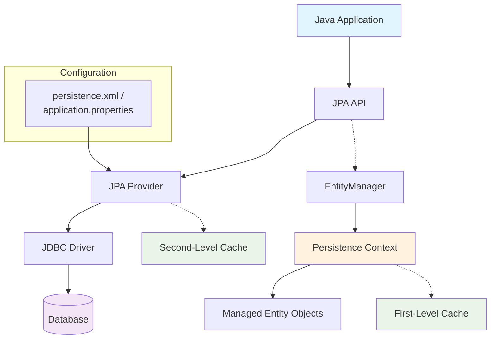
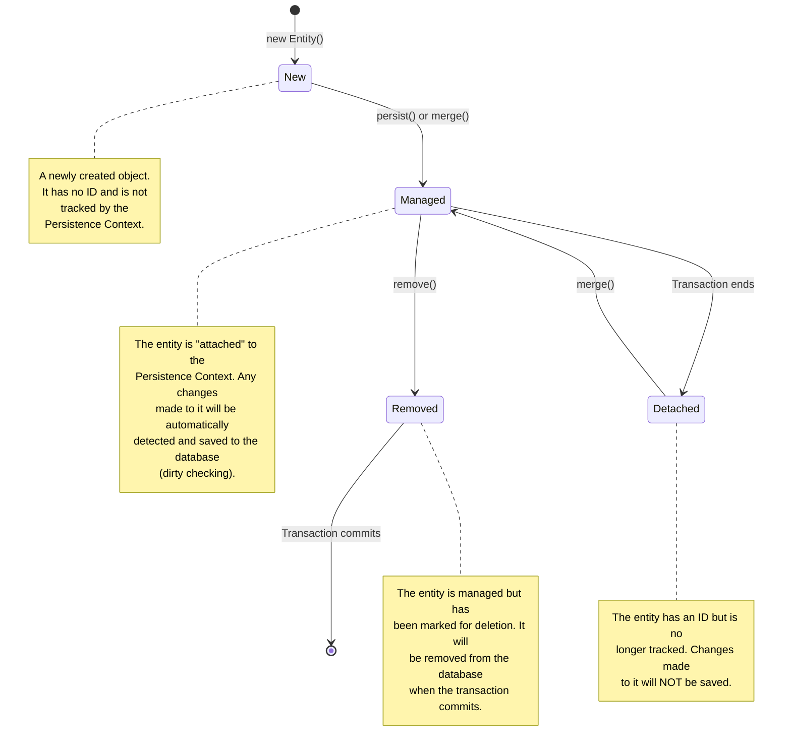

# A Quick Primer on JPA

## What is JPA?

The Java Persistence API (JPA) is a standard specification that defines how to manage relational data in Java applications. It provides an object-relational mapping (ORM) framework that allows developers to work with databases using plain Java objects, abstracting away much of the boilerplate JDBC and SQL code.

## JPA Architecture Overview



### Key Components

-   **Entity**: A simple Java class (`POJO`) that is annotated with `@Entity` and maps to a table in the database.
-   **EntityManager**: The main interface you use to interact with JPA. You use it to `persist`, `find`, `merge`, and `remove` entities.
-   **Persistence Context**: The heart of JPA. It is a set of managed entity instances. Think of it as a first-level cache or a "unit of work" that tracks all changes made to your entities. **Any changes to a managed entity within a transaction are automatically detected (this is called dirty checking) and saved to the database when the transaction commits.**
-   **JPA Provider**: The implementation of the JPA specification. **Hibernate** is the most popular provider and is the default in Spring Boot.

## The Entity Lifecycle

An entity instance goes through several states. Understanding this lifecycle is key to understanding how JPA works.



## Core Annotations

### Entity Mapping

```java
@Entity
@Table(name = "users") // Maps this entity to the "users" table
public class User {
    @Id // Marks this field as the primary key
    @GeneratedValue(strategy = GenerationType.SEQUENCE) // Lets the database generate the ID
    private Long id;
    
    @Column(name = "email", nullable = false, unique = true) // Maps to a column with constraints
    private String email;
    
    @Column(name = "first_name", length = 50)
    private String firstName;
}
```

### Relationship Mappings

-   **`@ManyToOne`**: A "many" to "one" relationship. Many `Employee` entities can be related to one `Department`. This is the side that typically owns the foreign key.
-   **`@OneToMany`**: The inverse of a `@ManyToOne` relationship. One `Department` can have many `Employee` entities.
-   **`@ManyToMany`**: A "many" to "many" relationship, which requires a join table in the database.

```java
// The "many" side of the relationship
@Entity
public class Employee {
    @ManyToOne(fetch = FetchType.LAZY) // ✅ LAZY is a best practice
    @JoinColumn(name = "department_id") // Defines the foreign key column
    private Department department;
}

// The "one" side of the relationship
@Entity
public class Department {
    // "mappedBy" tells JPA that the Employee entity owns this relationship.
    // This is crucial for an efficient bidirectional mapping.
    @OneToMany(mappedBy = "department", cascade = CascadeType.ALL, fetch = FetchType.LAZY)
    private List<Employee> employees;
}
```

## Fetching Strategies: Lazy vs. Eager

-   **`FetchType.LAZY`**: (Default for collections like `@OneToMany`) The associated data is **not** loaded until you explicitly access it (e.g., by calling `department.getEmployees()`). This is highly efficient and is the recommended default.
-   **`FetchType.EAGER`**: (Default for single associations like `@ManyToOne`) The associated data is loaded immediately with the parent entity in the same query. **⚠️ Warning:** While convenient, this is a common source of performance problems as it can easily lead to fetching too much data.

## Transaction Management

All database modifications in JPA must occur within a transaction. Spring Boot makes this easy with the `@Transactional` annotation.

-   The transaction begins when a `@Transactional` method is called.
-   The Persistence Context is created and associated with the transaction.
-   When the method completes, the transaction commits. Hibernate performs a dirty check, and all changes to managed entities are automatically flushed to the database.

```java
@Service
@Transactional
public class UserService {
    
    // This method inherits the class-level transaction settings.
    public User save(User user) {
        return userRepository.save(user);
    }

    // ✅ Best Practice: Use readOnly=true for query methods.
    // This provides a performance optimization and prevents accidental updates.
    @Transactional(readOnly = true)
    public User findById(Long id) {
        return userRepository.findById(id).orElse(null);
    }
}
```

## Spring Data JPA

Spring Data JPA dramatically simplifies the data access layer by removing the need for boilerplate repository code. You simply define a repository interface, and Spring provides the implementation at runtime.

```java
// Just by defining this interface, you get save(), findById(), findAll(), delete(), etc.
public interface UserRepository extends JpaRepository<User, Long> {
    
    // Spring Data creates a query automatically from the method name.
    List<User> findByStatus(String status);
    
    // For more complex logic, you can provide your own query.
    @Query("SELECT u FROM User u WHERE u.email LIKE %?1")
    List<User> findByEmailContaining(String emailFragment);
}
```

## Basic Configuration (`application.yml`)

```yaml
spring:
  datasource:
    url: jdbc:postgresql://localhost:5432/mydatabase
    username: user
    password: password
  jpa:
    hibernate:
      # ⚠️ DDL-auto should NEVER be set to "update" or "create" in production.
      # Use a migration tool like Flyway or Liquibase instead.
      ddl-auto: validate
    show-sql: true # Great for development to see the generated SQL.
    properties:
      hibernate:
        format_sql: true
        default_batch_fetch_size: 25
```

---

## Next Steps

This primer covers the fundamental concepts you'll need to work effectively with JPA. To build high-performance applications, it's critical to understand not just what these tools do, but also how to use them correctly.

Now that you have refreshed the basics, proceed to the **[JPA Best Practices Summary](./jpa_best_practices.md)** to see how these concepts are applied correctly and to explore the common pitfalls you should avoid.
