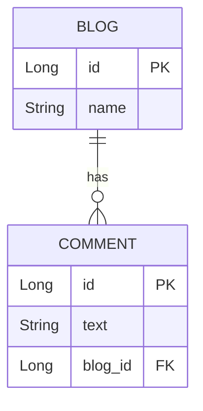
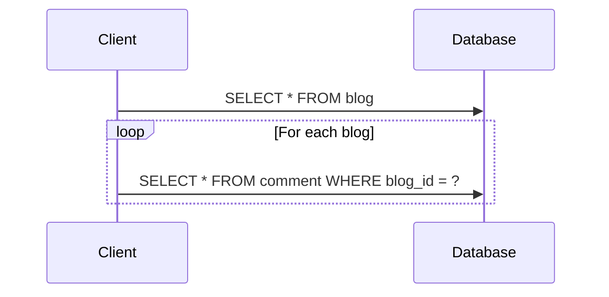
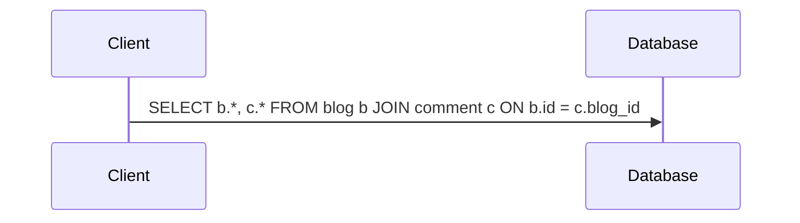
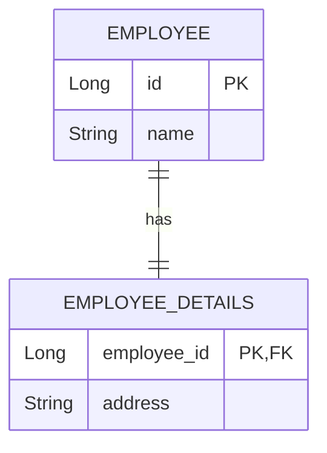
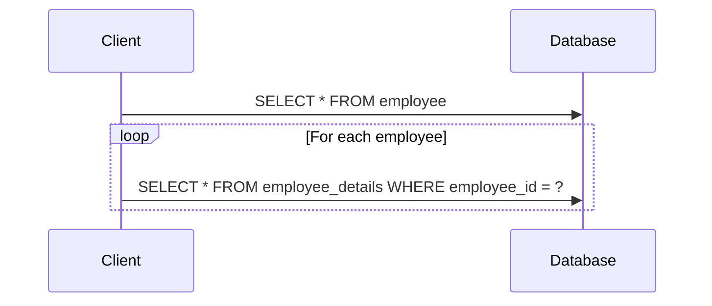
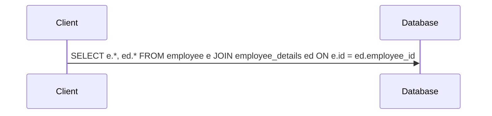

# Understanding the N+1 Query Problem in JPA

The N+1 query problem is a common performance issue in applications that use Object-Relational Mapping (ORM) frameworks like JPA and Hibernate. It occurs when the data access layer executes one query to retrieve the parent entities and then one additional query for each parent entity to fetch its related child entities. This results in a total of N+1 queries, where N is the number of parent entities, leading to significant performance degradation.

## One-to-Many Relationship: The N+1 Problem

Let's consider a classic example with `Blog` and `Comment` entities, where a `Blog` can have multiple `Comment`s.

### ER Diagram



### Entities

Here are the entity definitions:

```java
// Blog.java
@Entity
public class Blog {
    @Id
    @GeneratedValue(strategy = GenerationType.IDENTITY)
    private Long id;
    private String name;

    @OneToMany(mappedBy = "blog", cascade = CascadeType.ALL, fetch = FetchType.LAZY)
    private List<Comment> comments = new ArrayList<>();

    // Getters and setters
}

// Comment.java
@Entity
public class Comment {
    @Id
    @GeneratedValue(strategy = GenerationType.IDENTITY)
    private Long id;
    private String text;

    @ManyToOne(fetch = FetchType.LAZY)
    @JoinColumn(name = "blog_id")
    private Blog blog;

    // Getters and setters
}
```

By default, `@OneToMany` relationships are lazily fetched. This means that when you query for blogs, the associated comments are not loaded until they are explicitly accessed.

### The Problem in Action

Now, let's see how the N+1 problem manifests. Suppose we want to retrieve all blogs and print the first comment for each blog.

```java
// Fetching all blogs
List<Blog> blogs = blogRepository.findAll(); // 1 query to fetch all blogs

// Iterating through the blogs to access their comments
for (Blog blog : blogs) {
    System.out.println("Blog: " + blog.getName());
    if (!blog.getComments().isEmpty()) {
        // This line triggers a separate query for each blog to fetch its comments
        System.out.println("First Comment: " + blog.getComments().get(0).getText());
    }
}
```

If there are 5 blogs in the database, this code will execute 6 queries:
1.  **One query** to fetch all the blogs.
2.  **Five additional queries** (one for each blog) to fetch the comments.

This is the N+1 problem.



### Solution: Using `JOIN FETCH`

To solve this, we can use a `JOIN FETCH` clause in our query to tell JPA to fetch the associated comments in the same query that retrieves the blogs.

```java
// BlogRepository.java
public interface BlogRepository extends JpaRepository<Blog, Long> {
    @Query("SELECT b FROM Blog b JOIN FETCH b.comments")
    List<Blog> findAllWithComments();
}
```

Now, when we call `blogRepository.findAllWithComments()`, JPA will execute a single query that joins the `Blog` and `Comment` tables, retrieving all the necessary data at once.



## One-to-One Relationship: The N+1 Problem

The N+1 problem can also occur in `@OneToOne` relationships, especially when the non-owning side of the relationship is fetched. Let's consider an example with `Employee` and `EmployeeDetails` entities.

### ER Diagram



### Entities

```java
// Employee.java
@Entity
public class Employee {
    @Id
    @GeneratedValue(strategy = GenerationType.IDENTITY)
    private Long id;
    private String name;

    @OneToOne(mappedBy = "employee", cascade = CascadeType.ALL, fetch = FetchType.LAZY)
    private EmployeeDetails employeeDetails;

    // Getters and setters
}

// EmployeeDetails.java
@Entity
public class EmployeeDetails {
    @Id
    private Long id;
    private String address;

    @OneToOne(fetch = FetchType.LAZY)
    @MapsId
    @JoinColumn(name = "employee_id")
    private Employee employee;

    // Getters and setters
}
```

### The Problem in Action

If we fetch a list of `Employee` entities and then access their `EmployeeDetails`, we will encounter the N+1 problem.

```java
// Fetching all employees
List<Employee> employees = employeeRepository.findAll(); // 1 query to fetch all employees

// Iterating through employees to access their details
for (Employee employee : employees) {
    // This line triggers a separate query for each employee to fetch their details
    System.out.println("Employee: " + employee.getName() + ", Address: " + employee.getEmployeeDetails().getAddress());
}
```



### Solution: Using an Entity Graph

An entity graph is a template that defines which associations to fetch. We can define a named entity graph on our `Employee` entity.

```java
// Employee.java
@Entity
@NamedEntityGraph(name = "Employee.withDetails", attributeNodes = @NamedAttributeNode("employeeDetails"))
public class Employee {
    // ...
}

// EmployeeRepository.java
public interface EmployeeRepository extends JpaRepository<Employee, Long> {
    @EntityGraph(value = "Employee.withDetails")
    List<Employee> findAll();
}
```

By using `@EntityGraph`, we instruct JPA to fetch the `employeeDetails` association along with the `Employee` entities, thus resolving the N+1 problem with a single query.

