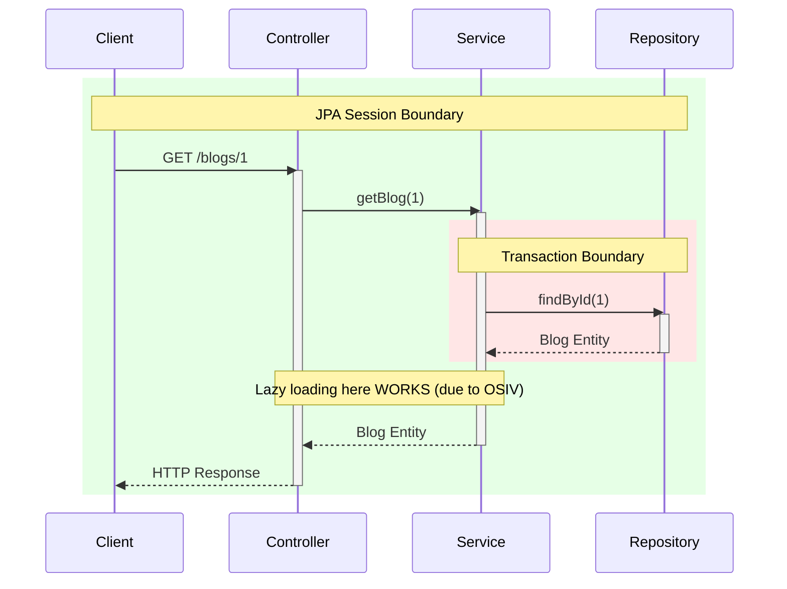
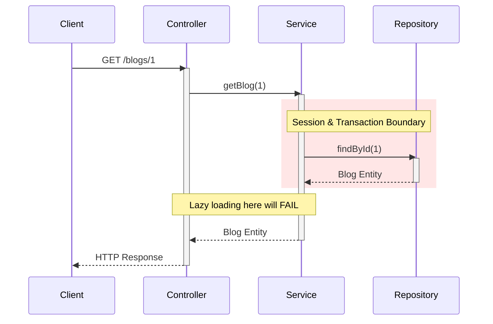
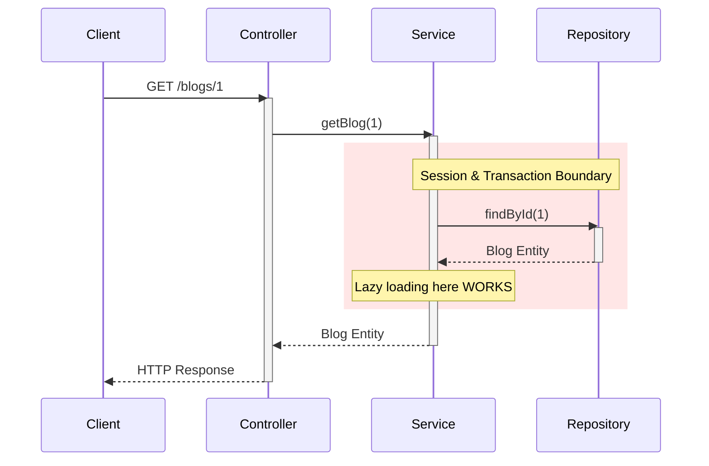
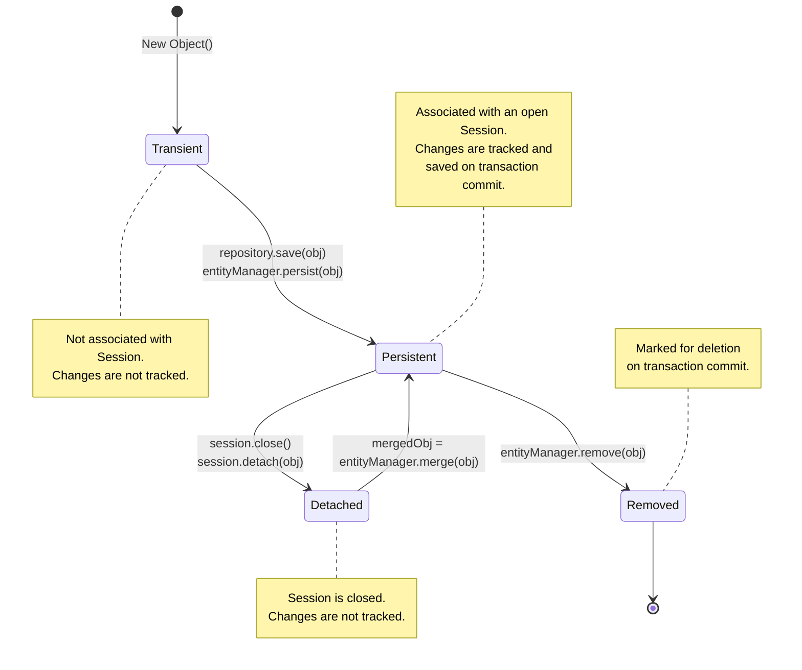

# Transaction vs. JPA Session Boundary in Spring

A clear guide to understanding and controlling your query execution in Spring Data JPA. This article clarifies the often-confusing relationship between a database **Transaction** and a JPA **Session**.

---

## Core Concepts

### 1. Transaction (`@Transactional`)

A transaction is a unit of work that ensures data integrity. All operations within a transaction either succeed together or fail together (atomicity). In Spring, this is most commonly managed using the `@Transactional` annotation.

### 2. JPA Session (`EntityManager`)

The JPA Session (represented by the `EntityManager`) is the bridge between your application and the database. It manages a "persistence context," which is a cache of all the entity objects it has loaded. The session is responsible for:
- Fetching entities from the database.
- Tracking changes to entities.
- Writing changes back to the database.

---

## How Boundaries Behave: 3 Scenarios

The interaction between the Session and Transaction boundaries changes based on your configuration. Here are the three most common scenarios.

### Scenario 1: Default Spring Boot (OSIV Enabled)
In a default setup, `spring.jpa.open-in-view` is `true`. The JPA Session stays open for the entire web request, while a smaller transaction is used for the repository call. This allows lazy loading to work outside the transaction, but can hold database connections for too long.

### Scenario 2: OSIV Disabled (No Service Transaction)
When OSIV is disabled and the service layer is not transactional, the session and transaction boundaries are identical and only cover the repository call. This is very efficient but inflexible, as any lazy loading outside the repository method will fail.

### Scenario 3: Recommended (OSIV Disabled + @Transactional Service)
This is the recommended approach. By disabling OSIV and annotating the service method with `@Transactional`, you extend both the session and transaction boundary to cover the entire service logic. This allows for complex operations and lazy loading within the service, while ensuring resources are released promptly.

---

## The "Open Session In View" Anti-Pattern

-   **Why does OSIV exist?** It was created for server-side view technologies (like JSP) to prevent `LazyInitializationException` when rendering views that accessed lazy-loaded entity fields.
-   **Why is it an anti-pattern now?** For modern REST APIs, OSIV can be harmful. It holds database connections open for longer than necessary, which can exhaust the connection pool under high load and hide performance issues like the N+1 query problem.
-   **Recommendation:** For most applications, it's best to disable OSIV.

> **How to Disable OSIV:** Add this to your `application.properties`:
> `spring.jpa.open-in-view=false`

When OSIV is disabled, the Session Boundary shrinks to be identical to the Transaction Boundary.

---

## JPA Entity Lifecycle

An entity instance passes through several states. Understanding these states is key to knowing when your changes will be saved.

---

## Summary: How Entities Behave

This table summarizes how entities behave based on the boundaries.

### Table 1: OSIV Enabled (Default)

| | **Within Transaction** (In `@Transactional` method) | **Outside Transaction** (e.g., In Controller, after Tx) |
| :--- | :--- | :--- |
| **Lazy Loading** | ✅ **Works** | ✅ **Works** (This is the main effect of OSIV) |
| **Modifying Data** | ✅ **Saved Automatically** (Dirty checking) | ❌ **Not Saved** (No active transaction to commit) |

### Table 2: OSIV Disabled (`spring.jpa.open-in-view=false`)

When OSIV is disabled, the Session closes with the Transaction, so the "Outside Transaction" column is also "Outside Session".

| | **Within Transaction** (In `@Transactional` method) | **Outside Transaction** (Entity is now DETACHED) |
| :--- | :--- | :--- |
| **Lazy Loading** | ✅ **Works** | ❌ **Fails** (`LazyInitializationException`) |
| **Modifying Data** | ✅ **Saved Automatically** | ❌ **Not Saved** (Entity is detached) |

By disabling OSIV and ensuring all database work happens within a clear `@Transactional` boundary, you gain better control over your application's performance and resource management.
